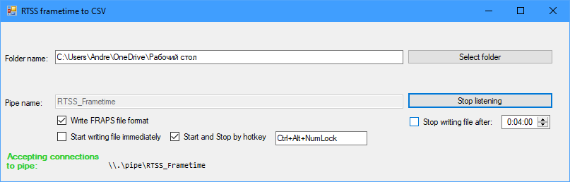

# RTSS_time_reader
## What is this and what for
It is small lightweight utility intended for reading frametimes provided by RivaTuner Statistics Server (RTSS) and writing them to file.

## How to use it
1. Start RivaTuner Statistics Server.
2. Start RTSS_time_reader.
   - Optionaly you can select target folder for files with captured frametimes.
   - Optionaly you can select format for target files by checking on unchecking "Write FRAPS file format" checkbox.
   - Optionaly you can check checkbox "Start writing immediately" to start writing file immediately on RTSS starting provide data.
   - Optionaly you can change hotkey used to start/writing files.
   - Optionaly you can set timer time on elapsed that will stopped writing file.
3. Start your game or another 3d program.
4. Press hotkey to start or stop writing captured times.

# Special thanks to
Алексей Николайчук also known as Unwinder for help and special interface with new pipe \\\\.\\PIPE\\RTSS_FrametimeV2
But currently i'm not using it.
